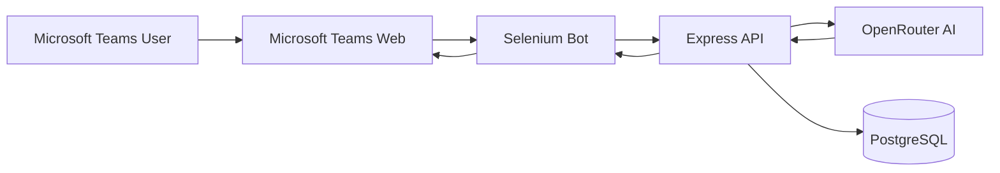
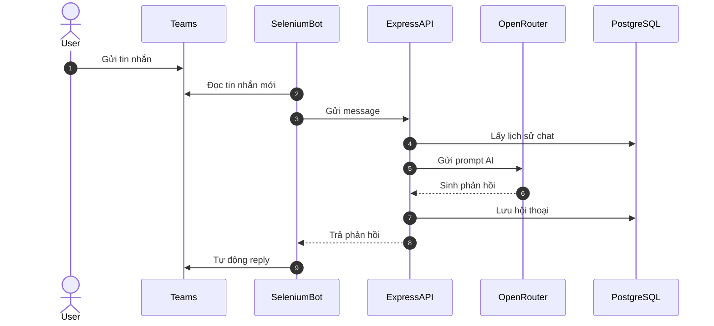
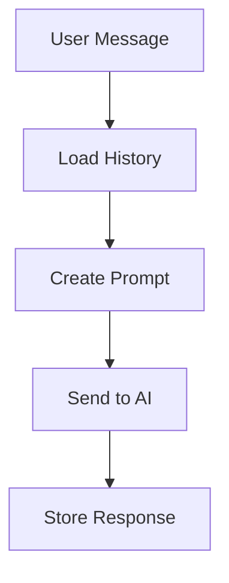
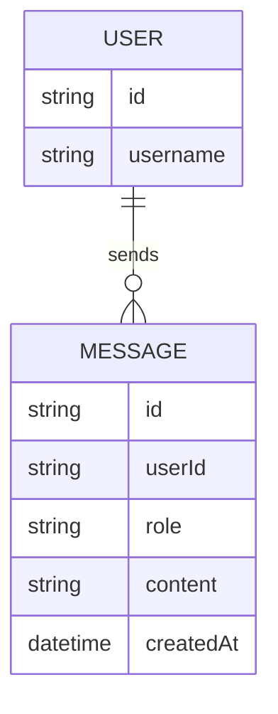

# MSTeam Chatbot

AI-powered Microsoft Teams chatbot using Selenium automation, Express API, PostgreSQL memory storage, and OpenRouter/OpenAI models.

---

## GIỚI THIỆU

MSTeam Chatbot là một hệ thống chatbot tự động dành cho Microsoft Teams.

Dự án sử dụng Selenium để tự động đọc tin nhắn từ giao diện Microsoft Teams Web, gửi nội dung tới AI model thông qua OpenRouter API, sau đó phản hồi trực tiếp vào khung chat.

Hệ thống có khả năng:

* Tự động đọc tin nhắn mới trong Microsoft Teams
* Gửi dữ liệu tới AI model
* Sinh phản hồi tự động
* Lưu lịch sử hội thoại vào PostgreSQL
* Duy trì memory theo từng user
* Chạy như một bot automation liên tục

### Công nghệ sử dụng

| Thành phần              | Công nghệ            |
| ----------------------- | -------------------- |
| Front-end Chat Platform | Microsoft Teams      |
| Automation              | Selenium WebDriver   |
| Back-end API            | Express.js           |
| Runtime                 | Node.js + TypeScript |
| Database                | PostgreSQL           |
| AI Provider             | OpenRouter API       |
| AI Model                | GPT-4o-mini          |
| Environment Management  | dotenv               |

---

## TÁC GIẢ

| STT | Họ tên        | MSSV     |
| --- | ------------- | -------- |
| 1   | Vi Hùng Vương | 20235881 |

---

# MÔI TRƯỜNG HOẠT ĐỘNG

## Thành phần hệ thống

Hệ thống bao gồm:

* Microsoft Teams Web
* Selenium Bot
* Express API Server
* OpenRouter AI Service
* PostgreSQL Database

## Nền tảng vận hành

| Thành phần  | Hệ điều hành  |
| ----------- | ------------- |
| Development | Windows 10/11 |
| Runtime     | Node.js       |
| Database    | PostgreSQL    |
| Browser     | Google Chrome |

---

# KIẾN TRÚC HỆ THỐNG



---

# LUỒNG HOẠT ĐỘNG



---

# HƯỚNG DẪN CÀI ĐẶT

## 1. Clone project

```bash
git clone https://github.com/vivuong166/MSTeam_Chatbot.git
cd MSTeam_Chatbot
```

---

## 2. Cài dependencies

```bash
npm install
```

---

## 3. Cài PostgreSQL

Tạo database:

```sql
CREATE DATABASE chatbot;
```

---

## 4. Tạo file `.env`

```env
OPENROUTER_API_KEY=your_api_key
DB_PASSWORD=your_password
```

---

## 5. Chạy API server

```bash
npm run dev
```

Server mặc định chạy tại:

```txt
http://localhost:3000
```

---

## 6. Chạy Selenium Teams Bot

```bash
npm run bot
```

Sau khi browser mở:

1. Đăng nhập Microsoft Teams
2. Mở đoạn chat cần bot hoạt động
3. Chờ bot bắt đầu đọc tin nhắn

---

# SELF TEST

## Tình huống kiểm thử

### Input

User gửi:

```txt
Hello bot
```

### Quá trình

* Selenium đọc message
* AI xử lý nội dung
* PostgreSQL lưu history
* Bot gửi phản hồi

### Output

```txt
Chào bạn 😄
```

---

# CẤU TRÚC THƯ MỤC

```txt
MSTeam_Chatbot/
│
├── rag/
│   ├── data.json
│   ├── ingest.ts
│   └── search.ts
│
├── scripts/
│   └── teamsBot.ts
│
├── src/
│   ├── bot/
│   │   ├── bot.ts
│   │   └── handler.ts
│   │
│   ├── db/
│   │   └── index.ts
│   │
│   ├── memory/
│   │   └── dbMemory.ts
│   │
│   ├── services/
│   │   └── openai.ts
│   │
│   ├── utils/
│   │   └── logger.ts
│   │
│   └── index.ts
│
├── package.json
├── tsconfig.json
└── README.md
```

---

# TÍCH HỢP HỆ THỐNG

## Selenium Automation

Bot sử dụng Selenium WebDriver để:

* Đăng nhập Microsoft Teams
* Đọc tin nhắn mới
* Tìm message mới nhất
* Bỏ qua tin nhắn của chính bot
* Tự động nhập phản hồi

### Đoạn selector chính

```ts
By.css('div[data-tid="chat-pane-message"]')
```

---

## Express API

Express server chịu trách nhiệm:

* Nhận request chat
* Xử lý AI logic
* Kết nối database
* Trả phản hồi về bot

### API route

```ts
app.post("/chat", handleChat);
```

---

## PostgreSQL

Database dùng để:

* Lưu lịch sử chat
* Tạo memory theo user
* Duy trì context hội thoại

---

# CÁC THUẬT TOÁN CƠ BẢN

## 1. Conversation Memory

Bot lưu lịch sử hội thoại theo user.



---

## 2. Duplicate Message Detection

Bot tránh trả lời trùng bằng biến:

```ts
let lastMessage: string | null = null;
```

Nếu message mới giống message trước:

```ts
if (text === lastMessage)
```

thì bot bỏ qua.

---

## 3. AI Response Cleaning

Hệ thống loại bỏ emoji Unicode không tương thích Selenium:

```ts
.replace(/[\u{10000}-\u{10FFFF}]/gu, "")
```

---

## 4. Safe History Filtering

Lọc message null để tránh lỗi API:

```ts
const safeHistory = history.filter(
  (msg: any) => msg.content && typeof msg.content === "string"
);
```

---

# THIẾT KẾ CƠ SỞ DỮ LIỆU

## ERD



---

## Giải thích bảng

### USER

Lưu thông tin người dùng.

| Field    | Ý nghĩa       |
| -------- | ------------- |
| id       | ID người dùng |
| username | Tên user      |

---

### MESSAGE

Lưu lịch sử hội thoại.

| Field     | Ý nghĩa        |
| --------- | -------------- |
| id        | ID message     |
| userId    | Người gửi      |
| role      | user/assistant |
| content   | Nội dung       |
| createdAt | Thời gian      |

---

# API PAYLOAD

## Chat Request

```json
POST /chat

{
  "userId": "user123",
  "message": "Hello"
}
```

---

## Chat Response

```json
{
  "reply": "Xin chào 😄"
}
```

---

# ĐẶC TẢ HÀM

## getAIResponse()

### Chức năng

Gửi prompt tới OpenRouter AI và nhận phản hồi.

### Prototype

```ts
getAIResponse(userId: string, message: string)
```

### Tham số

| Parameter | Ý nghĩa       |
| --------- | ------------- |
| userId    | ID người dùng |
| message   | Nội dung chat |

### Output

```ts
Promise<string>
```

---

## cleanText()

### Chức năng

Loại bỏ emoji và ký tự không tương thích Selenium.

```ts
function cleanText(text: string)
```

---

# XỬ LÝ LỖI

## Lỗi OpenAI/OpenRouter API

### Nguyên nhân

API nhận message null.

### Lỗi

```txt
Invalid value for 'content': expected a string, got null
```

### Giải pháp

Lọc lịch sử:

```ts
history.filter(...)
```

---

## Selenium Reply Loop

### Nguyên nhân

Bot tự đọc message của chính mình.

### Giải pháp

Bỏ qua:

```ts
if (className.includes("ChatMyMessage"))
```

---

## Emoji Crash

### Nguyên nhân

Selenium không hỗ trợ một số Unicode emoji.

### Giải pháp

Remove emoji bằng regex.

---

# ĐIỂM NỔI BẬT CỦA DỰ ÁN

* Tích hợp AI thực tế với Microsoft Teams
* Tự động hóa bằng Selenium
* Memory conversation bằng PostgreSQL
* TypeScript backend architecture
* AI chatbot hoạt động realtime
* Có khả năng mở rộng thành multi-user chatbot

---

# HƯỚNG PHÁT TRIỂN

* Tích hợp RAG thật với vector database
* Hỗ trợ nhiều channel Teams
* Thêm authentication
* Dashboard monitoring
* Docker deployment
* Queue system
* WebSocket realtime
* Voice assistant

---

# KẾT QUẢ

## Chức năng đã hoàn thành

* AI chatbot hoạt động trên Microsoft Teams
* Selenium automation hoạt động ổn định
* PostgreSQL memory storage
* OpenRouter integration
* TypeScript backend

---

## Ảnh minh họa

### Teams Chat Demo

> Thêm screenshot tại đây

### AI Response Demo

> Thêm screenshot tại đây

### PostgreSQL Database

> Thêm screenshot tại đây

---

# VIDEO DEMO

> Thêm link YouTube/video demo tại đây

---

# LICENSE

MIT License
