# PROJECT SAMPLE

# MSTeam Chatbot

AI-powered Microsoft Teams chatbot using Selenium automation, Express API, PostgreSQL memory storage, and OpenRouter/OpenAI models.

---

## GIỚI THIỆU

MSTeam Chatbot là một hệ thống chatbot AI tự động dành cho Microsoft Teams. Hệ thống sử dụng Selenium để tự động đọc tin nhắn từ giao diện Teams Web, gửi nội dung tới AI model thông qua OpenRouter/OpenAI API và phản hồi trực tiếp trong cuộc trò chuyện.

### Các chức năng chính

* Tự động đọc tin nhắn mới từ Microsoft Teams
* Tự động phản hồi bằng AI
* Lưu lịch sử hội thoại vào PostgreSQL theo từng user
* Quản lý memory riêng biệt theo user_id
* Tích hợp OpenRouter/OpenAI model
* Chạy automation bằng Selenium
* Hỗ trợ chatbot realtime

### Ảnh minh họa

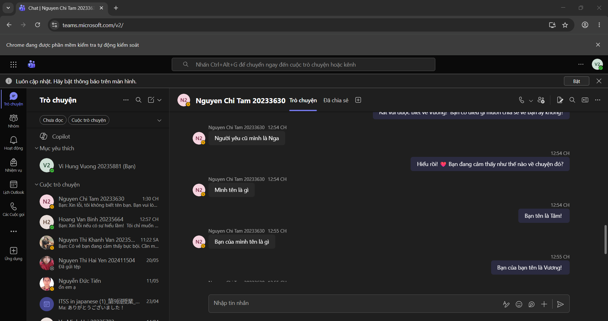

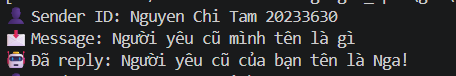

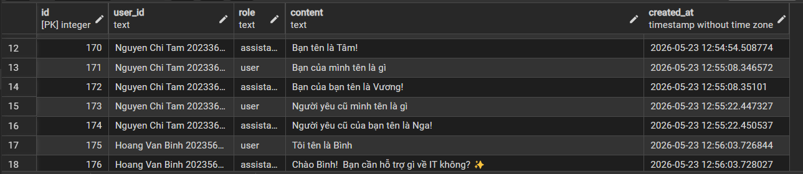

### Công nghệ sử dụng

| Thành phần              | Công nghệ            |
| ----------------------- | -------------------- |
| Front-end Chat Platform | Microsoft Teams      |
| Automation              | Selenium WebDriver   |
| Back-end API            | Express.js           |
| Runtime                 | Node.js + TypeScript |
| Database                | PostgreSQL           |
| AI Provider             | OpenRouter API       |
| AI Model                | GPT-4o-mini          |
| Environment Management  | dotenv               |

---

## TÁC GIẢ

| STT | Họ tên        | MSSV     |
| --- | ------------- | -------- |
| 1   | Vi Hùng Vương | 20235881 |

---

## MÔI TRƯỜNG HOẠT ĐỘNG

### Thành phần hệ thống

Hệ thống bao gồm:

* Microsoft Teams Web
* Selenium Bot
* Express API Server
* OpenRouter AI Service
* PostgreSQL Database

### Nền tảng vận hành

| Thành phần  | Hệ điều hành  |
| ----------- | ------------- |
| Development | Windows 10/11 |
| Runtime     | Node.js       |
| Database    | PostgreSQL    |
| Browser     | Google Chrome |

* Microsoft Teams Web được sử dụng làm nền tảng chat chính.
* Selenium WebDriver chạy trên máy local để đọc và gửi tin nhắn.
* Express API chịu trách nhiệm xử lý logic chatbot.
* PostgreSQL dùng để lưu lịch sử hội thoại và memory.
* OpenRouter/OpenAI API dùng để sinh phản hồi AI.

### Sơ đồ tích hợp hệ thống

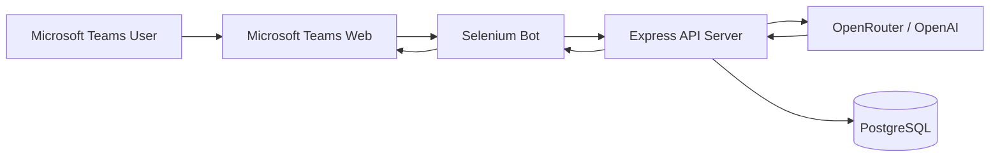

### Luồng xử lý message

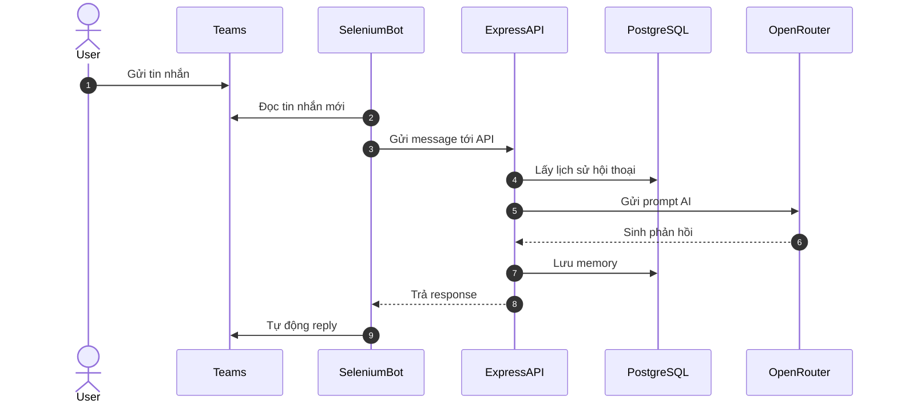

---

## HƯỚNG DẪN CÀI ĐẶT

## 1. Clone project

```bash
git clone https://github.com/vivuong166/MSTeam_Chatbot.git
cd MSTeam_Chatbot
```

---

## 2. Cài dependencies

```bash
npm install
```

---

## 3. Cài PostgreSQL

Tạo database và bảng:

```sql
CREATE DATABASE chatbot;

\c chatbot

CREATE TABLE messages (
    id SERIAL PRIMARY KEY,
    user_id TEXT NOT NULL,
    role TEXT NOT NULL,
    content TEXT NOT NULL,
    created_at TIMESTAMP DEFAULT NOW()
);
```

---

## 4. Tạo file `.env`

```env
OPENROUTER_API_KEY=your_api_key
DB_PASSWORD=your_password
```

---

## 5. Chạy API server

```bash
npm run dev
```

Server mặc định chạy tại:

```txt
http://localhost:3000
```

---

## 6. Chạy Selenium Teams Bot

```bash
npm run bot
```

Sau khi browser mở:

1. Đăng nhập Microsoft Teams
2. Mở đoạn chat cần bot hoạt động
3. Chờ bot bắt đầu đọc tin nhắn

---

### Self Test

## Tình huống kiểm thử

### Input

User gửi:

```txt
Hello bot
```

### Quá trình

* Selenium đọc message
* AI xử lý nội dung
* PostgreSQL lưu history
* Bot gửi phản hồi

### Output

```txt
Chào bạn 😄
```

---

# CẤU TRÚC THƯ MỤC

```txt
MSTeam_Chatbot/
│
├── assets/
│   ├── teams-chat.png
│   ├── console-bot.png
│   ├── database.png
│   └── api-test.png
│
├── rag/
│   ├── data.json
│   ├── ingest.ts
│   └── search.ts
│
├── scripts/
│   └── teamsBot.ts
│
├── src/
│   ├── bot/
│   │   ├── bot.ts
│   │   └── handler.ts
│   │
│   ├── db/
│   │   └── index.ts
│   │
│   ├── memory/
│   │   └── dbMemory.ts
│   │
│   ├── services/
│   │   └── openai.ts
│   │
│   ├── utils/
│   │   └── logger.ts
│   │
│   └── index.ts
│
├── package.json
├── tsconfig.json
└── README.md
```

---

# TÍCH HỢP HỆ THỐNG

## Selenium Automation

Bot sử dụng Selenium WebDriver để:

* Đăng nhập Microsoft Teams
* Đọc tin nhắn mới
* Tìm message mới nhất của người khác (bỏ qua tin của chính bot)
* Xác định user_id người gửi qua `data-mid` và `author-{mid}`
* Tự động nhập phản hồi

### Đoạn selector chính

```ts
// Lấy tất cả message trong chat
By.css('div[data-tid="chat-pane-message"]')

// Lấy tên người gửi theo message id
By.id(`author-${mid}`)
```

---

## Express API

Express server chịu trách nhiệm:

* Nhận request chat
* Xử lý AI logic
* Kết nối database
* Trả phản hồi về bot

### API route

```ts
app.post("/chat", handleChat);
```

### Ảnh minh họa API

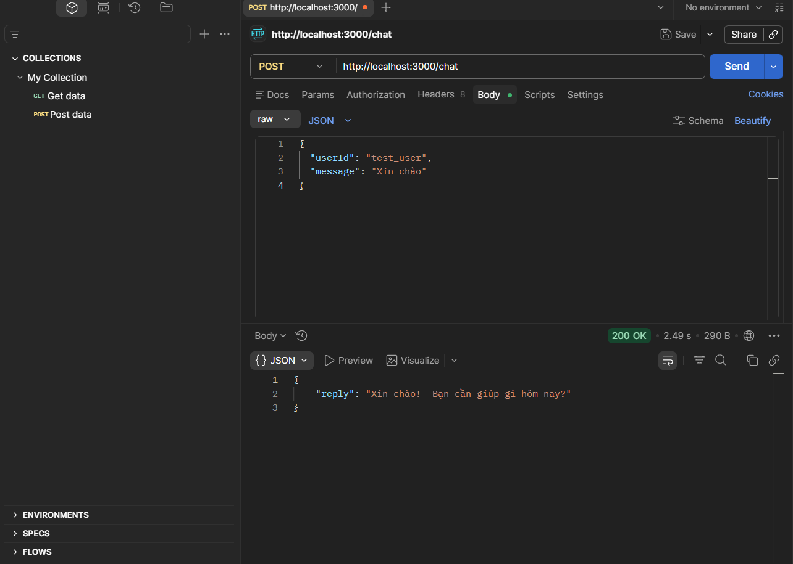

---

## PostgreSQL

Database dùng để:

* Lưu lịch sử chat theo từng `user_id`
* Duy trì context hội thoại riêng biệt cho mỗi người
* Truy vấn lịch sử khi AI cần context

### Ảnh minh họa Database


---

# CÁC THUẬT TOÁN CƠ BẢN

## 1. Conversation Memory

Hệ thống lưu lịch sử hội thoại theo từng user để duy trì context khi chat.

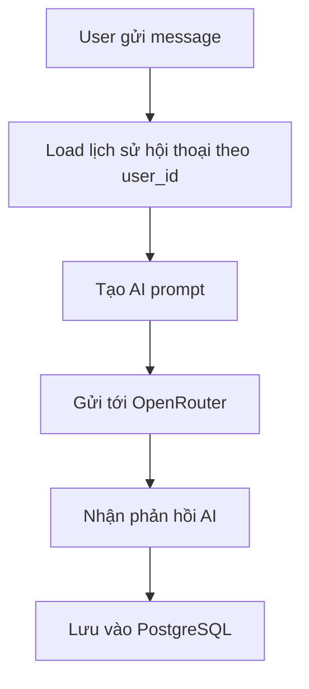

---

## 2. Duplicate Message Detection

Bot sử dụng biến `lastMessage` để tránh tự trả lời lại cùng một nội dung.

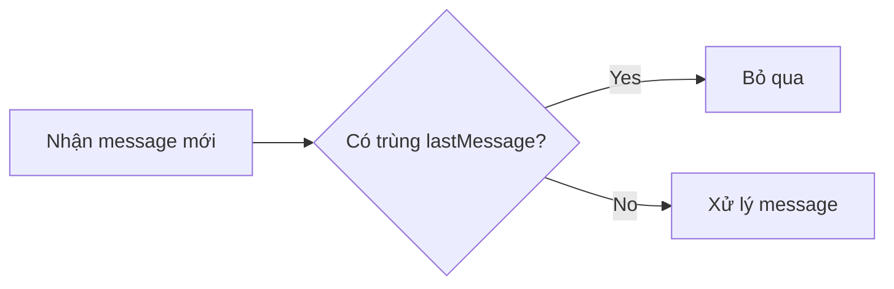

---

## 3. Selenium Auto Reply

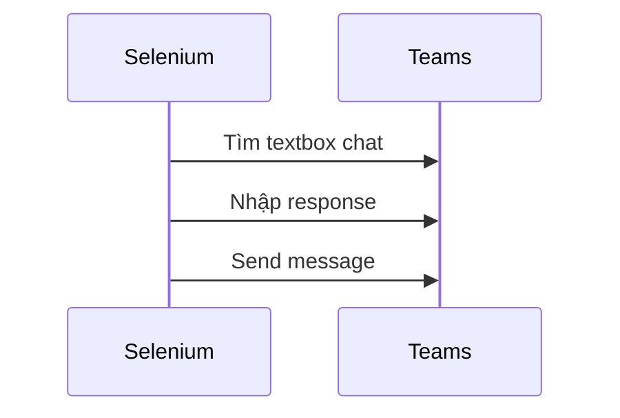

---

## 4. AI Response Filtering

Hệ thống lọc các message null và emoji Unicode không tương thích Selenium.

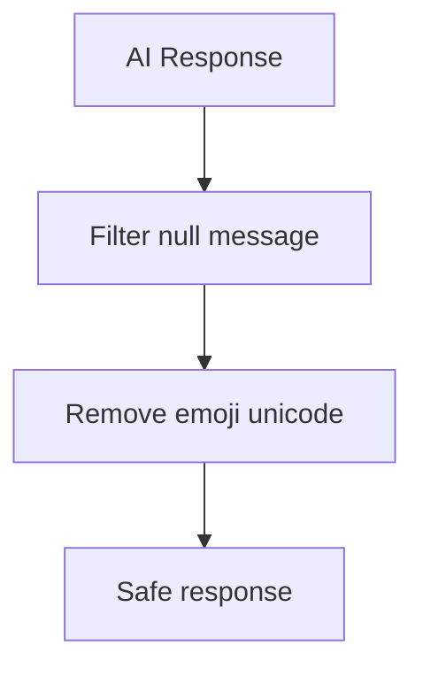

---

# THIẾT KẾ CƠ SỞ DỮ LIỆU

## ERD Database

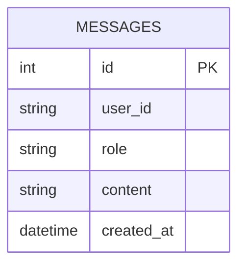

## Giải thích bảng

### MESSAGES

Lưu lịch sử hội thoại của tất cả người dùng.

| Field      | Ý nghĩa                  |
| ---------- | ------------------------ |
| id         | ID tự tăng (Primary Key) |
| user_id    | Tên người dùng từ Teams  |
| role       | `user` hoặc `assistant`  |
| content    | Nội dung tin nhắn        |
| created_at | Thời gian gửi            |

---

# API PAYLOAD

## Chat Request

```json
POST /chat

{
  "userId": "Nguyen Chi Tam 20233630",
  "message": "Xin chào"
}
```

---

## Chat Response

```json
{
  "reply": "Xin chào! Bạn cần giúp gì hôm nay?"
}
```

### Ảnh minh họa


---

# ĐẶC TẢ HÀM

## getAIResponse()

### Chức năng

Lấy lịch sử hội thoại của user, gửi prompt tới OpenRouter AI và nhận phản hồi.

### Prototype

```ts
getAIResponse(userId: string, message: string): Promise<string>
```

### Tham số

| Parameter | Ý nghĩa       |
| --------- | ------------- |
| userId    | ID người dùng |
| message   | Nội dung chat |

---

## cleanText()

### Chức năng

Loại bỏ emoji và ký tự không tương thích Selenium.

```ts
function cleanText(text: string): string
```

---

## getHistory()

### Chức năng

Lấy lịch sử hội thoại của một user từ PostgreSQL.

```ts
getHistory(userId: string): Promise<Message[]>
```

---

## addMessage()

### Chức năng

Lưu một tin nhắn vào PostgreSQL.

```ts
addMessage(userId: string, role: "user" | "assistant", content: string): Promise<void>
```

---

# XỬ LÝ LỖI

## Lỗi OpenAI/OpenRouter API

### Nguyên nhân

API nhận message null.

### Lỗi

```txt
Invalid value for 'content': expected a string, got null
```

### Giải pháp

Lọc lịch sử trước khi gửi:

```ts
const safeHistory = history.filter(
  (msg: any) => msg.content && typeof msg.content === "string"
);
```

---

## Selenium Reply Loop

### Nguyên nhân

Bot tự đọc message của chính mình.

### Giải pháp

Bỏ qua tin có class `ChatMyMessage`:

```ts
if (className.includes("ChatMyMessage")) continue;
```

---

## Sai user_id (lấy nhầm tên bot)

### Nguyên nhân

`driver.findElement` tìm toàn trang, lấy phần tử đầu tiên — có thể là tên bot.

### Giải pháp

Lấy `data-mid` từ message bubble, tìm đúng element `author-{mid}`:

```ts
const mid = await msg.getAttribute("data-mid");
const authorEl = await driver.findElement(By.id(`author-${mid}`));
senderId = (await authorEl.getText()).trim();
```

---

## Emoji Crash

### Nguyên nhân

Selenium không hỗ trợ một số Unicode emoji (supplementary plane).

### Giải pháp

Remove emoji bằng regex:

```ts
.replace(/[\u{10000}-\u{10FFFF}]/gu, "")
```

---

# ĐIỂM NỔI BẬT CỦA DỰ ÁN

* Tích hợp AI thực tế với Microsoft Teams
* Tự động hóa bằng Selenium
* Memory conversation theo từng user bằng PostgreSQL
* TypeScript backend architecture
* AI chatbot hoạt động realtime
* Có khả năng mở rộng thành multi-user chatbot

---

# HƯỚNG PHÁT TRIỂN

* Tích hợp RAG thật với vector database
* Hỗ trợ nhiều channel Teams
* Thêm authentication
* Dashboard monitoring
* Docker deployment
* Queue system
* WebSocket realtime
* Voice assistant

---

## KẾT QUẢ

### Các chức năng đã hoàn thành

* AI chatbot hoạt động trên Microsoft Teams
* Selenium automation hoạt động ổn định
* PostgreSQL memory storage theo từng user
* OpenRouter integration
* TypeScript backend
* Conversation memory
* AI auto-reply

### Ảnh kết quả


### Video demo

> [THÊM LINK VIDEO DEMO TẠI ĐÂY]

---

# LICENSE

MIT License