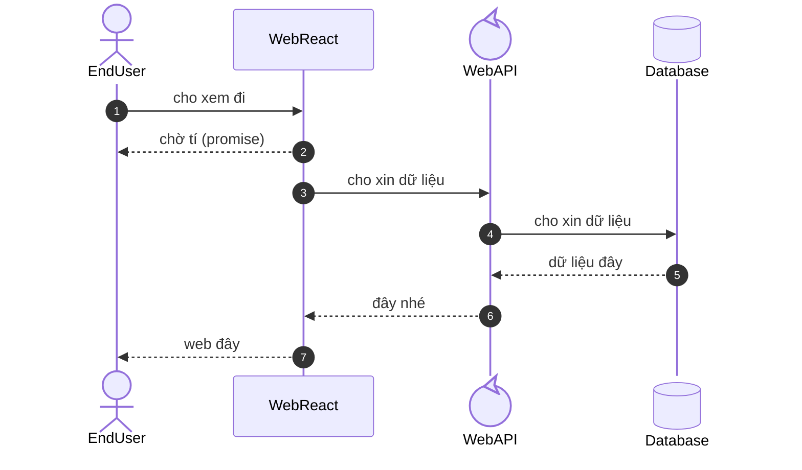
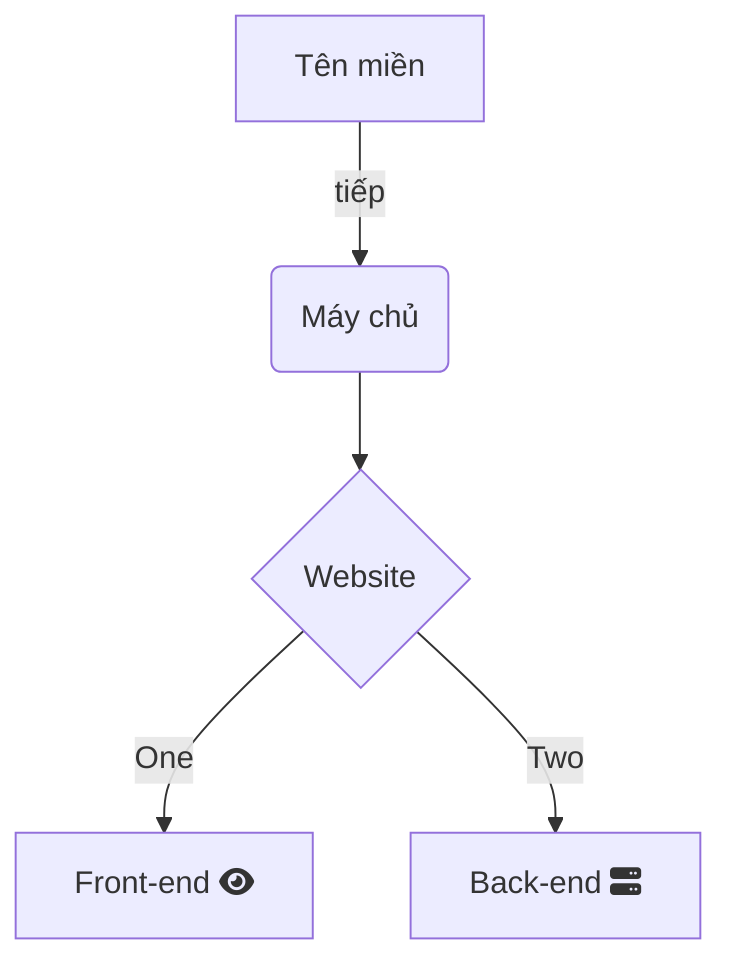
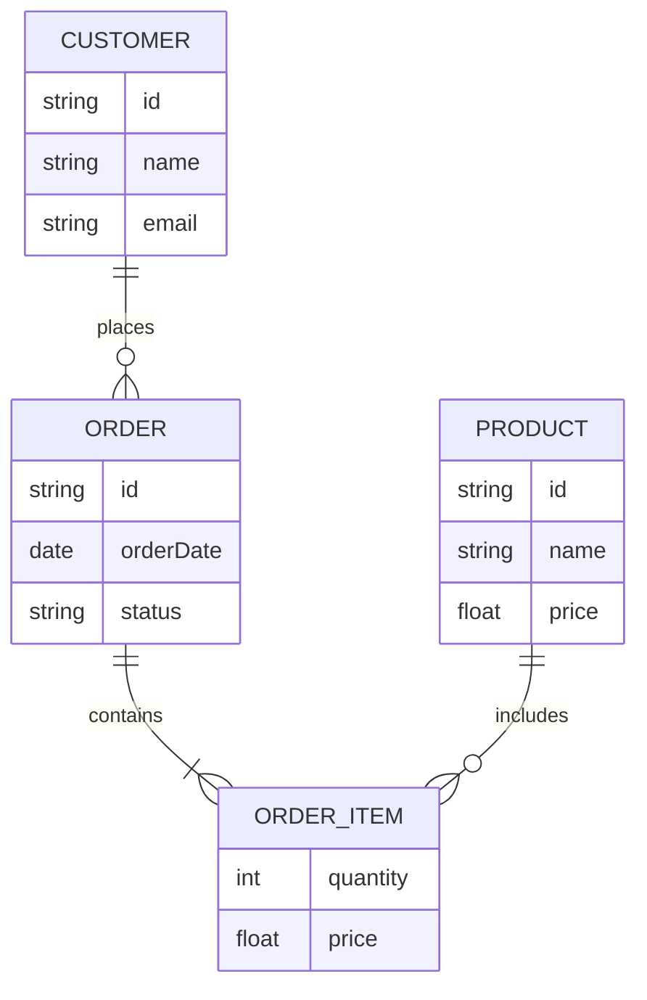

# PROJECT SAMPLE
  Mô tả nội dung cần báo cáo của môn đồ án
  > Sinh viên nên Fork

## GIỚI THIỆU

 - Mô tả lại tính năng, đề bài được yêu cầu.
 - Ảnh chụp minh họa:\
   

## TÁC GIẢ

- Tên nhóm:......
- Thành viên trong nhóm
  |STT|Họ tên|MSSV|
  |--:|--|--|
  |1|Nguyễn Hoàng Hải|20002987|

## MÔI TRƯỜNG HOẠT ĐỘNG

- Mô tả sơ lược về các thành phần như máy tính, mobile, thiết bị IoT... các máy chủ back-end, front-end, mqtt, database
- Thông tin về nền tảng OS mà hệ thống vận hành
- Nên có sơ đồ tích hợp hệ thống để người xem thấy được mối liên quan giữa các thành phần.
  
## HƯỚNG DẪN CÀI ĐẶT VÀ CHẠY THỬ

  Các bước đề cài đặt hệ thống. Trường hợp với IoT, có thể hướng dẫn ngắn gọn là: cắm điện, gạt công tắc ....
  Nêu ra một tình huống sử dụng đơn giản để chứng tỏ sản phẩm có vận hành đúng (Self Test)

## NGUYÊN LÝ CƠ BẢN

> Tham khảo cách trình bày như ở đây [Code Project](https://www.codeproject.com/Articles/5385907/Managing-Cplusplus-Projects-with-Conan-and-CMake)

### TÍCH HỢP HỆ THỐNG

- Mô tả các thành phần phần cứng và vai trò của chúng: máy chủ, máy trạm, thiết bị IoT, MQTT Server, module cảm biến IoT...
- Mô tả các thành phần phần mềm và vai trò của chúng, vị trí nằm trên phần cứng nào: Front-end, Back-end, Worker, Middleware...

> Nên sử dụng cú pháp mermaid trong markdown, cho phép từ text sinh ra đồ thị. Như vậy dễ hiệu chỉnh. Ví dụ, hoặc [có thể sửa online rồi copy vào tài liệu](https://mermaid.live/edit#pako:eNqFkrFOwzAQhl_FugmktmqbNC0ZEIgyMCAhJISEsrjJtbHU2MGxRUuVmZkHYGFjQDxAx_IifROuaQItFNWTff7-_-7sm0GoIgQfMry3KEPsCz7SPAkkKxe3RkmbDFBvxEKjNDuX0U22GU65NiIUKZeG3eLgGon79_b06uJkxgIw0xQD8GkXKmm0GgfA8t2qPjd8wDP8pYvK8LawrK5-fFyV4rMwVmyCCft8Fj9gdV0ntBStyOX8hZnFOztItUpEhoc7FIU3NVI6C8mi5fyDjcVy_mS3eIKIrhrYw1dYfSPBBkjlL16nf-y3Oi0QJuPF255GH3CwhqEGIy0i8Id8nGENEtQJX51htrKgB48xqV4ch9yOTQCBzElHn3OnVAK-0ZaUWtlRXB1sSt9TTdU3gTJCfaasNOB3CgPwZzAB32m2Gi2PluM1nbbnujWYUtRreG33qOd22r2u1207eQ0ei4zNRq9LBhgJmsjL9SgXE51_AYzG7q0)


### CÁC THUẬT TOÁN CƠ BẢN

- Ví dụ: tạo token bằng JWT.
- Ví dụ: băm mật khẩu bằng MD5 theo công thức: MD5(key+"myapp"+key).
- Ví dụ: tạo id cho đối tượng bằng GUID, hoặc bằng hàm random.

> Nên sử dụng cú pháp mermaid trong markdown, cho phép từ text sinh ra đồ thị. Như vậy dễ hiệu chỉnh. Ví dụ, hoặc [có thể sửa online rồi copy vào tài liệu](https://www.mermaidchart.com/play?utm_source=mermaid_live_editor&utm_medium=share#pako:eNqrVkrOT0lVslJKy8kvT85ILCpRCHGJyVMAAsfokMOr8hRyMx_ubsyLVdDVtaspyXy4a39BjYKThu_hhZUKyRkPdy_XhKh2AilQcK4OT00qzixJrYWIOoO1-eel1ii4RLsV5eeV6KbmpSikJVqlJeqmVqbGIisLKc-vUXCNdkpMzkZSVZxaVJZaBFSoVAsA0_I7vg)




### THIẾT KẾ CƠ SỞ DỮ LIỆU

- Sơ đồ quan hệ thực thể để thể hiện mối quan hệ giữa các trường thông tin.
- Giải thích các table, và một vài table.field quan trọng
- Cấu trúc các file cấu hình như .env, .conf, .xml

> Nên sử dụng cú pháp mermaid trong markdown, cho phép từ text sinh ra đồ thị. Như vậy dễ hiệu chỉnh. Ví dụ, hoặc [có thể sửa online rồi copy vào tài liệu](https://mermaidchart.com/play?utm_source=mermaid_live_editor&utm_medium=share#pako:eNqdUsGKwjAQ_ZUw5yra1qq5qoc9iIurl6WwhCatgTbpphNYt_rvm7ZWlIKHndPM4-XNy2NqSDQXQEGYtWSZYUWsiKvV8eOw22725HIZjXRNdvu1Gygpc5aIquN0WEO43Ahfb4fN1rESrZBJdeO973fr4-rwJNUzpUpyy3vF-9a6m5uq0EiVEckHkGKFGICiYDLv0OujzdeKnKEg2nCXgusG1AoZ2upJtf_UP5ymuWZISiMTMTTaBfOgKhWSb8sUSjy_0gAPMiM50JTllfCgEMZF4WZoxWLAk3AugLqWi5TZHGOIVfOuZOpT6wIoGuteGm2zUz_Yssnmdht3hlAuqpW2CoEuWwGgNfwADSbT8TRyFUSTwI_C0IOzQ6Nx5IfLRTjzF_No7gdXD37bjZPxYj7zQHCJ2my7U2wv8voHm3HFLQ) 



### CÁC PAYLOAD

- Cấu trúc các gói json
- Nội dung trao đổi giữa các module, cảm biến

 > Trường hợp thiết kế web-api và có swagger, có thể chụp screenshot vài bức ảnh từ swagger ra, dán trực tiếp vào giao diện soạn thảo trên GitHub
 


### ĐẶC TẢ HÀM

- Một số hàm quan trọng
- Mô tả ý nghĩa của hàm, tham số vào, ra
- Hoặc có thể tham chiếu, chụp ảnh từ các công cụ như swagger, pydoc, javadoc, doxygen

  ```C
     /**
      *  Hàm tính ...
      *  @param  x  Tham số
      *  @param  y  Tham số
      */
     void abc(int x, int y = 2);
  ```

 > Trường hợp thiết kế web-api và có swagger, có thể chụp screenshot vài bức ảnh từ swagger ra, dán trực tiếp vào giao diện soạn thảo trên GitHub
 


### PHÁT SINH

_Các sự cố, vẫn đề, lỗi mà không xử lý được, hoặc xử lý mất quá 4h thì nên ghi vào đây, hoặc ghi vào [issue của GitHub](https://github.com/neittien0110/ProjectSample/issues). Sẽ được tính điểm. Ví dụ__

- __Lỗi: blablablabla__
  - Chi tiêt: .....
  - Nguyên nhân: ...
  - Giải pháp: chưa có

  
## KẾT QUẢ
Các ảnh chụp với caption giải thích.
Hoặc video sản phẩm
